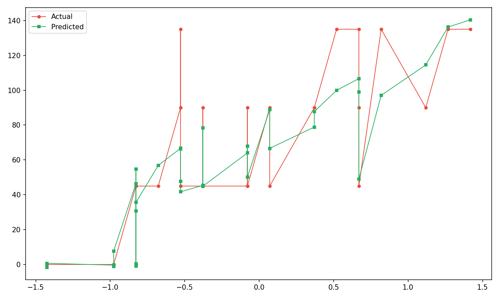
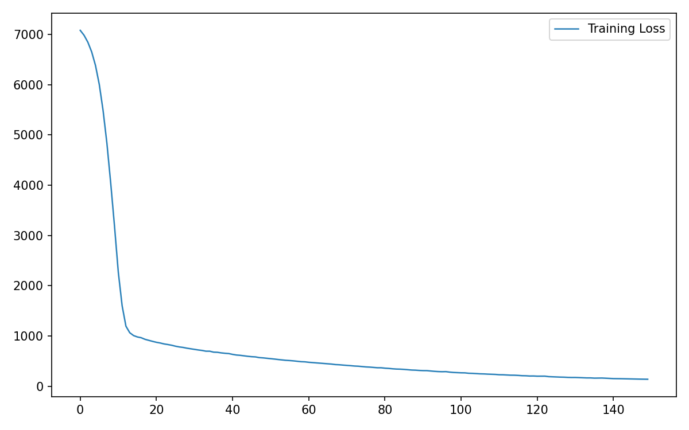
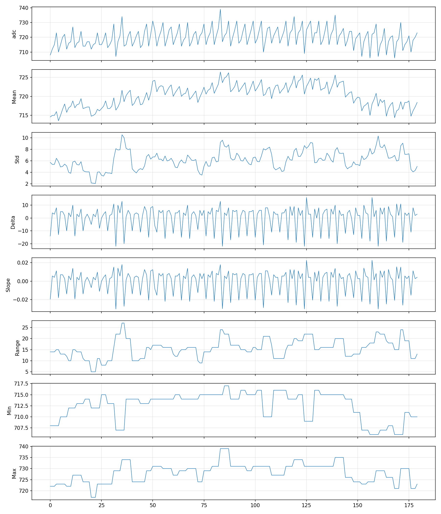
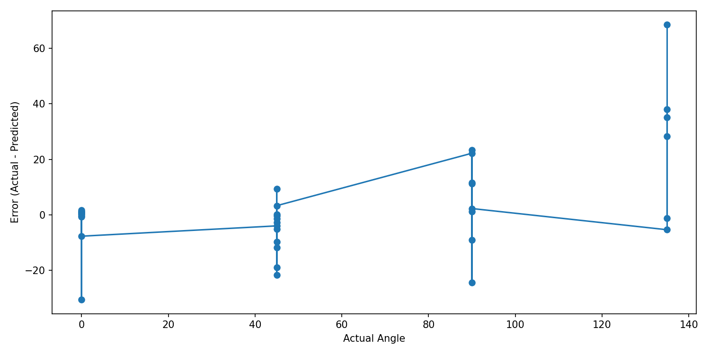

# Knee Monitoring System 🦵📈

An AI-powered system designed to monitor knee kinematics in real-time. By utilizing a deep learning regression model, the system processes raw Analog-to-Digital Converter (ADC) values from wearable sensors (e.g., flex sensors, strain gauges, or smart knee sleeves) to predict knee flexion/extension angles ($0^\circ$ to $140^\circ$) and classify user activities (Sitting, Standing, and Walking).

---

## 🌟 Key Features
- **Deep Learning Regression**: Multi-layer feedforward neural network built with TensorFlow/Keras to accurately map sensor voltages to knee angles.
- **Temporal Feature Engineering**: Converts 1D raw sensor timeseries into multidimensional feature vectors using rolling statistics.
- **Real-Time Activity Recognition**: Classifies movement patterns (Sitting, Standing, Walking) based on rolling kinematics and heuristic rules.
- **Automated Performance Diagnostics**: Generates publication-ready metrics and visual plots on every training run.

---

## 📂 Repository Structure

The project is organized as follows:

- 🐍 **Scripts**:
  - [train_model.py](file:///c:/Projects/Knee-Monitoring-System/train_model.py) – Preprocesses training datasets, extracts rolling window features, trains the neural network model, and saves outputs.
  - [predict_live.py](file:///c:/Projects/Knee-Monitoring-System/predict_live.py) – Loads the saved model and scaler, runs inference on live sensor logs, classifies user activity, and outputs predictions.
- 📊 **Datasets**:
  - [train_data.csv](file:///c:/Projects/Knee-Monitoring-System/train_data.csv) – Labeled dataset containing `angle` (ground truth) and corresponding `adc` sensor readings.
  - [live_data.csv](file:///c:/Projects/Knee-Monitoring-System/live_data.csv) – Unlabeled simulated live sensor data stream (`adc`).
- 🤖 **Models & Configs**:
  - `knee_angle_model.keras` – The trained TensorFlow/Keras Sequential regression model.
  - `scaler.pkl` – Pickled `StandardScaler` to ensure consistent live feature scaling.
- 📈 **Visualizations**:
  - `features_plot.png` – Time-series visualization of all 8 engineered rolling features.
  - `model_loss.png` – Training loss convergence profile.
  - `actual_vs_predicted.png` – Regression performance comparing target vs predicted angles.
  - `error_plot.png` – Deviation analysis showing prediction errors across angles.
  - [live_predictions.csv](file:///c:/Projects/Knee-Monitoring-System/live_predictions.csv) – Output predictions containing calculated angles and classified activities.

---

## 🛠️ Installation & Setup

Ensure you have Python 3.8+ installed. Install the required dependencies using pip:

```bash
pip install numpy pandas scikit-learn tensorflow matplotlib
```

---

## 🚀 How to Use

### 1. Train the Neural Network
Train the knee angle regression model on the calibration dataset. This step optimizes network weights and saves the preprocessors:

```bash
python train_model.py
```

Upon completion, it will:
1. Print the performance metrics (**Mean Absolute Error** and **Mean Squared Error**).
2. Save the trained model to `knee_angle_model.keras`.
3. Save the scaler to `scaler.pkl`.
4. Update the performance diagnostics plots in the root directory.

### 2. Predict on Live Data
Process a new stream of raw sensor data to track real-time knee flexion and identify movements:

```bash
python predict_live.py
```

This will run inference on the data inside [live_data.csv](file:///c:/Projects/Knee-Monitoring-System/live_data.csv) and write the predictions to [live_predictions.csv](file:///c:/Projects/Knee-Monitoring-System/live_predictions.csv) with the following outputs:
- Real-time predicted angle (clamped to physiological limits: $0^\circ$ to $140^\circ$).
- Classified activity (Sitting, Standing, or Walking).
- Summary statistics of predicted activities.

---

## 🧠 Machine Learning Details

### 1. Rolling Feature Extraction
To capture temporal dynamics (such as velocity, direction, and speed of bending) rather than relying solely on static ADC values, the system uses a **rolling window of size 5** ($N=5$) to extract 8 distinct features:

| Feature Name | Description | Mathematical / Logic Representation |
|:---|:---|:---|
| `adc` | Raw sensor value | $x_t$ |
| `Mean` | Rolling average value | $\frac{1}{N} \sum_{i=0}^{N-1} x_{t-i}$ |
| `Std` | Standard deviation (instability/movement noise) | $\sqrt{\frac{1}{N-1} \sum_{i=0}^{N-1} (x_{t-i} - \mu)^2}$ |
| `Max` | Rolling maximum sensor reading | $\max(x_{t}, ..., x_{t-N+1})$ |
| `Min` | Rolling minimum sensor reading | $\min(x_{t}, ..., x_{t-N+1})$ |
| `Range` | Range of motion in window | $\text{Max} - \text{Min}$ |
| `Delta` | Absolute velocity | $x_t - x_{t-1}$ |
| `Slope` | Relative velocity rate | $\frac{x_t - x_{t-1}}{x_{t-1}}$ |

### 2. Neural Network Architecture
The regression model is built as a sequential deep neural network:
- **Input Layer**: 8 units (corresponding to the 8 engineered features).
- **Hidden Layer 1**: 32 neurons, ReLU activation.
- **Hidden Layer 2**: 16 neurons, ReLU activation.
- **Hidden Layer 3**: 8 neurons, ReLU activation.
- **Output Layer**: 1 neuron, Linear activation (predicts continuous angle).
- **Optimizer**: Adam
- **Loss Function**: Mean Squared Error (MSE)
- **Epochs**: 150 (Batch Size: 8, Validation Split: 10%)

### 3. Activity Classification Heuristics
Activities are determined using rolling window statistics (window size = 5) over the **predicted angles**:
1. **Walking**: If the predicted angle range ($\text{max} - \text{min}$) within the window is $\ge 30^\circ$, it indicates active joint rotation.
2. **Standing**: If the mean predicted angle is $\ge 110^\circ$, indicating the leg is mostly straight/extended.
3. **Sitting**: If the mean predicted angle is $\ge 30^\circ$ (and $< 110^\circ$), representing a bent/flexed knee state.
4. **Default/Fallback**: Standing.

---

## 📈 Visualizing Results

### Actual vs. Predicted Angle
Shows the model's regression line against actual calibration labels. Close alignment between actual and predicted angles highlights higher calibration accuracy.



### Model Loss (Convergence)
Visualizes the training process. The rapid decline in Mean Squared Error (MSE) indicates effective learning without overfitting.



### Feature Variations
Depicts the variations of all 8 statistical inputs over the duration of the data collection.



### Error Distribution Plot
Plots the residuals (Actual Angle - Predicted Angle) as a function of the joint angle to identify potential calibration drift or non-linear sensor responses.


